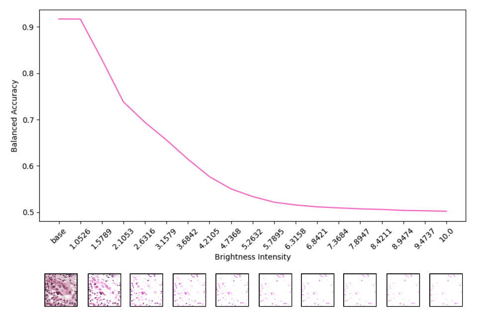

# Foundation Model Robustness Study for Computational Pathology

<p align="center">
    
</p>

## Overview
This repository evaluates the robustness of foundation models in computational pathology against image distortions.

**NOTE**: Ensure you apply for access to each foundation model on HuggingFace, and attach your HuggingFace token in a `.env` file as follows:

```dotenv
HF_TOKEN=YOUR_HF_TOKEN
```

### Supported tasks:
- **Fine-tuning**: Supports finetuning `UNI`, `GigaPath`, and `Virchow` on the `PCAM` dataset.
- **Inference**: Evaluate the robustness of the fine-tuned model on image distortions.

## Installation
```bash
pip install -r requirements.txt
```

## Fine-tune Configuration
Configure the fine-tuning hyperparameters through `src/configs/finetune.yaml`.
```yaml
encoder: uni
num_classes: 2
freeze_encoder: true

epochs: 10
batch_size: 100
eta_min: 1.0e-6
weight_decay: 0.0
learning_rate: 1.0e-4
```

## Fine-tune
Enter the `src` directory and run:
```bash
finetune.py
```

## Inference Configuration
Configure the inference hyperparameters through `src/configs/inference.yaml`.
```yaml
encoder: uni
num_classes: 2

batch_size: 10000
augmentation_mode: brightness
augmentation_min: 0
augmentation_max: 25
augmentation_step: 1
```

## Inference
Enter the `src` directory and run:
```bash
python inference.py
```