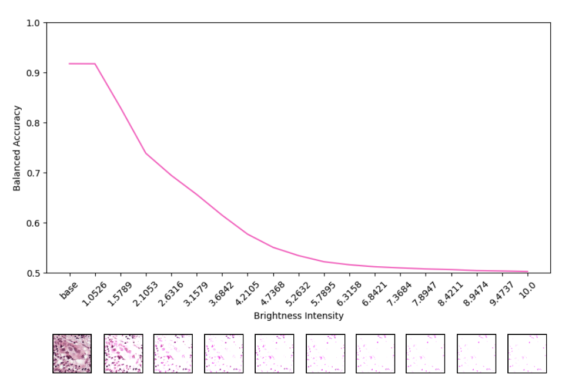

# PathPerturb: A Robustness Study for CPath Foundation Encoders

<p align="center">
    
</p>

## Overview
This repository evaluates the robustness of foundation models in computational pathology against image perturbations.

**NOTE**: Ensure you apply for access to each foundation model on HuggingFace, and attach your HuggingFace token in a `.env` file as follows:

```dotenv
HF_TOKEN=YOUR_HF_TOKEN
```

### Supported tasks:
- **Fine-tuning**: Supports finetuning `UNI`, `GigaPath`, and `Virchow` on the `PCAM` dataset.
- **Embedding extraction**: Extracts embeddings into a DeepLake dataset class for downstream experiments and analysis.
- **Dataset perturbation**: Distorts the image by a pre-defined percentage for downstream analysis.
- **Inference**: Evaluate the robustness of the fine-tuned model on image perturbations.

## Installation
```bash
pip install -r requirements.txt
```

## Embedding Configuration
Configure the embedding hyperparameters through `src/configs/embed.yaml`.
```yaml
encoder: uni
batch_size: 10
dataset: gleason-grading
```

## Extract Embeddings (without perturbations)
Enter the `src` directory and run:
```bash
# Enter src directory
cd src/

# Run embedding script
python embed.py
```


## Fine-tune Configuration
Configure the fine-tuning hyperparameters through `src/configs/finetune.yaml`.

```yaml
experiment_num: 0
dataset: gleason-grading

encoder: uni
num_classes: 5
precision: full
freeze_encoder: true
embedding_mode: true # whether training on pre-extracted embeddings.

epochs: 50
batch_size: 100
eta_min: 1.0e-6
weight_decay: 0.0
learning_rate: 1.0e-4
```

## Fine-tune
```bash
# Enter src directory
cd src/

#  Run fine-tuning script
python finetune.py
```

## Perturbation Configuration
Configure the perturbation hyperparameters through `src/configs/perturb.yaml`.
```yaml
encoder: uni
batch_size: 10
dataset: gleason-grading

perturbations:
  type: brightness
  range:
    min: -1.0
    max: 1.0
    interval: 0.2
```

## Perturbation Embedding Extraction
Enter the `src/tests/perturbations` directory and run:
```bash
# Enter perturbations directory
cd src/tests/perturbations

# Run script for perturbation embedding
python embed_perturbation.py
```